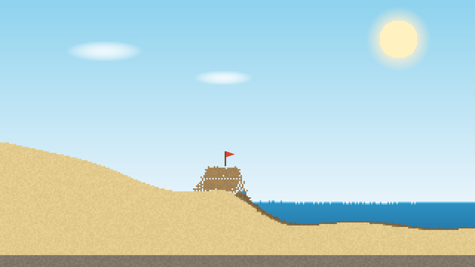
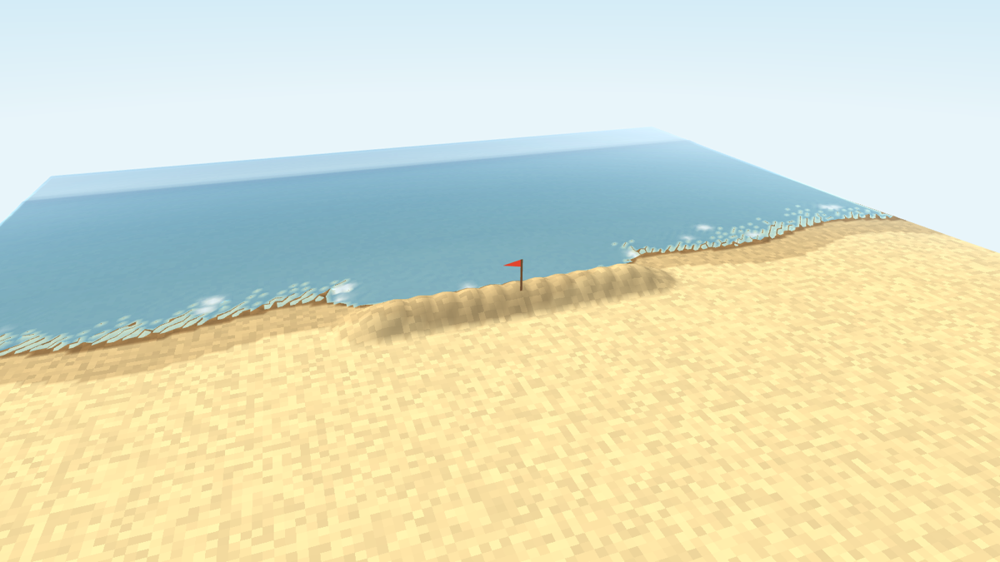
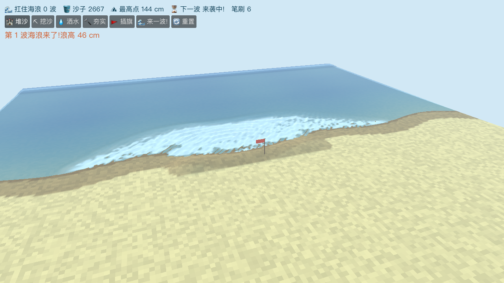
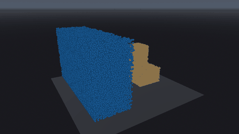
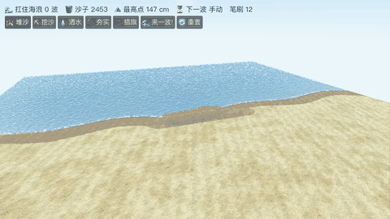

# Sandcastle Web Clone

A tiny browser fan remake ("demake") of [Sandcastle](https://store.steampowered.com/app/3216520/Sandcastle/) by Bubblebird Studio: pile up wet sand on the beach, shape a fortress, then watch the waves try to tear it down.

Pure HTML5 Canvas plus a falling-sand cellular automaton. Zero dependencies, single file.

**[Play the 2D game](https://hailiyuan-netmind.github.io/sandcastle-clone/)** · **[Try the 3D prototype](https://hailiyuan-netmind.github.io/sandcastle-clone/3d.html)**

## Features

- **Wet sand physics** on a 320x180 cellular automaton: wet sand is cohesive, so you can build vertical walls and 45 degree overhangs; sand soaked by seawater loosens and slumps; sand far from water slowly dries out and crumbles
- **Waves with momentum**: a surge front sweeps in from the sea, erodes walls on impact, throws up foam, floods moats, then recedes. Each wave is bigger than the last
- **Five tools**: pour sand, dig, sprinkle water, tamp (tamped sand resists erosion better), plant a flag
- **Sand is a finite resource**: dig a moat in front of your wall to collect sand and break incoming waves at the same time
- Plant the flag and see how many waves you can survive

## Controls

| Action | Input |
| --- | --- |
| Use current tool | Left mouse drag |
| Quick dig | Right mouse drag |
| Switch tools | Buttons, or keys `1` to `5` |
| Brush size | Slider, or `[` and `]` |
| Summon a wave | "来一波!" button |
| Pause | `Space` |

The UI text is in Chinese; the six buttons are: pour, dig, water, tamp, flag, wave.

## Run locally

Open `index.html` in any modern browser. No build step, no server.

## How it works

- Materials (empty, water, wet sand, dry sand, rock, foam) live in a `Uint8Array` grid; the simulation runs 2 steps per animation frame, roughly 120 Hz, scanning bottom-up with alternating direction to avoid bias
- **Cohesion rule**: a wet sand cell with nothing below only hangs on if a diagonal-below neighbor is itself standing on something solid. This allows corbelled overhangs but collapses floating lattices
- **Moisture** is tracked per sand cell (0 to 255). Contact with water raises it (saturated cells >= 210 turn loose and behave like dry sand); isolation lowers it until the cell dries out
- **Waves** are driven by a force front moving about 1.3 cells per step toward shore; water cells it passes get re-energized with shoreward momentum, so every wave reliably reaches the beach instead of dissipating mid-ocean. Fast water hitting sand can swap places with it, which chews realistic bites out of walls
- Rendering writes one RGBA pixel per cell into an offscreen `ImageData`, then upscales 3x with image smoothing disabled for a crisp pixel look

## 3D prototype

[`3d.html`](3d.html) is an early 3D remake of the same game loop, still single-file and dependency-free, written against raw WebGL2:

- Heightfield sand on a 192x192 grid, rendered as a GPU-displaced mesh (the CPU only uploads one RGBA32F field texture per frame)
- Shallow-water "pipe model" ocean: swells surge in from the open boundary, run up the beach, flood moats, then drain back
- Moisture-dependent angle of repose: dry sand rests at about 33 degrees, damp sand holds near-vertical walls, soaked sand slumps
- Flow-driven erosion with downstream sediment deposit, plus foam where the water churns
- Left-drag sculpts with the active tool, right-drag orbits the camera, wheel zooms

Same tools, wave scheduler, flag and sand economy as the 2D version. Full simulation plus rendering costs about 3 ms per frame on an Apple Silicon laptop.

## Godot vertical slice

[`godot/`](godot/) is the start of the real engine build (Godot 4.7, chosen for its text-first workflow and zero cost):

- The whole simulation runs as **GPU compute passes** ([`godot/sim.glsl`](godot/sim.glsl)) on ping-pong RGBA32F field textures: shallow-water pipe model, then a parallel-safe flux rewrite of the sand physics (moisture-dependent angle of repose, flow-driven erosion with downstream deposit), four dispatches per substep
- Sculpting tools (pour, dig, water, tamp) are applied inside the sand pass via brush push constants, and the sand-bucket economy is tracked with an atomic counter buffer read back at low rate
- Terrain and water are GPU-displaced planes whose spatial shaders sample the simulation texture directly through `Texture2DRD`, so field data never leaves the GPU; a low-rate CPU shadow copy powers ray picking, the flag and the HUD stats
- Full game loop: Chinese HUD, wave scheduler with growing waves, plantable flag with washed/undermined detection, reset
- Everything is built procedurally from [`godot/main.gd`](godot/main.gd); the whole project is plain text. Steady 60 fps on Apple Silicon (native Metal renderer)
- Try it: open the folder with Godot 4.7+, or `godot --path godot`. Left drag sculpts, right drag orbits, wheel zooms, keys 1-5 switch tools, `[` `]` resize the brush, `N` summons a wave
- Headless regression mode (builds a wall, digs a moat, plants the flag, summons a wave, saves a screenshot): `godot --path godot -- --shot=out.png --frames=430 --demo`

### MPM lab (in-engine)

[`godot/mpm.glsl`](godot/mpm.glsl) + [`godot/mpm.gd`](godot/mpm.gd) is a full **3D MLS-MPM solver running in Godot compute shaders**: 100K coupled water and sand particles on a 48^3 grid, six to seven substeps per frame on the GPU.

- Water uses a J-based EOS; sand uses fixed corotated elasticity with snow-style plasticity, including a 3x3 SVD (Jacobi on F^T F) written directly in GLSL
- P2G scatter uses fixed-point atomic adds; particles render as GPU point sprites fed by a `Texture2DRD` position texture, so nothing round-trips through the CPU
- Run it: `godot --path godot mpm.tscn`. Right-drag orbits, wheel zooms, `R` resets, Space pauses. Headless: `-- --shot=out.png --frames=N` or `-- --record=dir --frames=N`
### Heightfield + MPM coupling (in the game)

The main beach scene now runs a bounded MPM active zone on top of the heightfield ([`godot/mpm_zone.glsl`](godot/mpm_zone.glsl)):

- The heightfield is the MPM collision boundary (bilinear height + slope normal response in the grid pass)
- Strong erosion cells and churning foam cells emit spawn requests into a shared GPU queue; a ring-buffer pool of 32K particles consumes it, so waves visibly rip sand grains off walls and throw spray
- Settled sand particles deposit their volume back into the heightfield through an atomic image, closing the mass loop; spent spray rejoins the sea
- Everything stays on the GPU end to end, and the whole game still holds 60 fps on Apple Silicon

Still to close the gap with the real thing: sound, tide, scoring, art pass.

## Roadmap ideas

- Particle-level sand: see [research/](research/) for a working MPM feasibility demo (sand castle vs dam-break wave in Taichi) and the hybrid heightfield-plus-particles plan
- Sound and ambient audio
- A rising tide line across a session
- Scoring and a proper game-over state
- Particle-based foam and spray
- Touch UI polish for mobile

## Credits

Fan project inspired by [Sandcastle](https://store.steampowered.com/app/3216520/Sandcastle/) by Bubblebird Studio (Fabien Weibel). Not affiliated in any way. Go wishlist the real game.

Licensed under the [MIT License](LICENSE).
