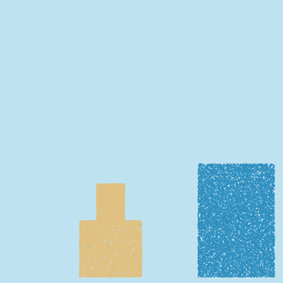

# Research: particle-based sand for the 3D version

The commercial Sandcastle game is closed source, so this folder collects our own
feasibility experiments toward matching its particle-level sand feel.

## MPM demo: sand castle vs dam-break wave



[`mpm_sand_demo.py`](mpm_sand_demo.py) is a 2D MLS-MPM simulation (adapted from
Taichi's classic `mpm99` example, MIT licensed) with water and sand coupled in a
single solver. A water column collapses, sweeps across the domain as a wave and
smashes into a sand castle. The plasticity clamp on the sand deformation
gradient makes the tower shear at the base and topple as a coherent chunk
instead of melting, which is exactly the failure mode that makes the real game
satisfying and that our heightfield prototype cannot reproduce.

### Measured performance

Apple Silicon, Metal backend via Taichi 1.7.4:

| Setup | Result |
| --- | --- |
| Particles | 26,000 (55% water, 45% sand) |
| Grid | 128 x 128, dt = 1e-4 |
| Throughput | ~756 substeps/s (including per-frame PNG encoding) |
| Effective sim rate | ~38 fps at 20 substeps per frame |

### Read-across to a 3D game

- 3D MPM costs roughly 3 to 4x more per particle (27-tap stencil, 3D SVD), and a
  playable beach scene needs about 100K to 500K active particles
- That is out of reach for Python-driven Taichi in a game loop, but well within
  reach for a native compute-shader implementation (GLSL/HLSL/Metal) at 60 fps
  on desktop GPUs, which is the standard approach for this class of game
- Practical architecture for our roadmap: keep the cheap heightfield ocean and
  beach from `3d.html` for the large-scale world, and run an MPM particle zone
  only around active interactions (the wave front, the player's brush), writing
  results back into the heightfield when particles settle
- Next step: port this solver to a compute shader inside the engine chosen for
  the real build (Godot 4 compute shaders or Unity), then profile the particle
  budget on target hardware

### Reproduce

```
python3 -m venv venv
venv/bin/pip install taichi pillow
venv/bin/python mpm_sand_demo.py frames
```
